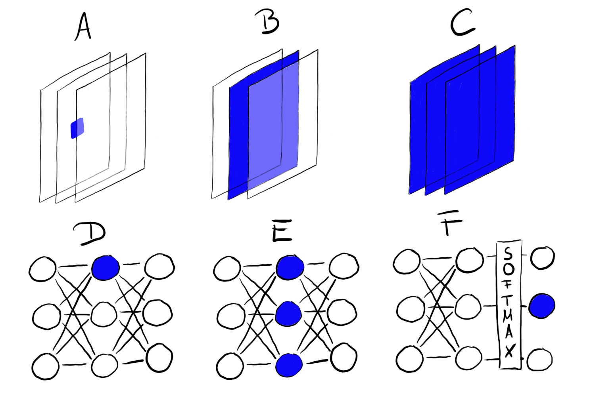

```{css, echo=FALSE}
.tiny .remark-code { 
  font-size: 50% !important;
}

h4 {
  margin-top: -5px;
  margin-bottom: -20px;
}

.code39 .remark-code {
  font-size: 39%;
}

.center2 {
  margin: 0;
  position: absolute;
  top: 50%;
  left: 50%;
  -ms-transform: translate(-50%, -50%);
  transform: translate(-50%, -50%);
}
```

```{r, include=FALSE}
library("grid")
library("gridExtra")
```

# Interpretable deep learning

In general, deep learning models are regarded as black box models.

In the case of **convolutional neural networks**, the learned representations
capture visual concepts thus they can be visualized and interpreted by humans.

There are several ways of doing this, most of them require considerable amount
of tinkering with keras/tensorflow.

This presentation focuses on three main methods in the context of convolutional
neural networks and image classification, and demonstrates them through simple
examples using R and Keras.

Some of the ideas can also be adapted to other deep learning models and tasks.

---

# Recap: Convnets


.pull-left[
### Filters

```{r, echo=FALSE, out.width = "400px"}

```
]

.pull-right[
### Convolutional layer

```{r, echo=FALSE, out.width = "400px"}

```
]

.footnote[
.font60[
Sources:
- https://codelabs.developers.google.com/codelabs/keras-flowers-tpu/#7
- https://livebook.manning.com/book/deep-learning-with-r/chapter-5/41
]
]

---

# Recap: Convnets (cont'd)


### Network architecture

.center2[
```{r, echo=FALSE, out.width = "1500px"}
knitr::include_graphics("cnn.jpg")
```
]

.footnote[
.font60[
Source: https://towardsdatascience.com/a-comprehensive-guide-to-convolutional-neural-networks-the-eli5-way-3bd2b1164a53
]
]

---

# Visualizing intermediate activations

We can feed an image into the model and visualize the activations at different
layers (and channels).

This is a straightforward method and it can help to understand what patterns the
neural net identifies in a given input.

- On lower layers filters detect edges and simple patterns. The activations
  retain most of the information present in the input.
- On higher layers, the encoded patterns are usually more complicated and
  abstract. The activations become sparser.
  
The disadvantage is that the output is very large (one activation image for each
channel), and, especially on higher levels, it becomes harder to discern (and
interpret) what the neural network detects.

---

# Example: Visualizing intermediate activations


.pull-left[
.code50[
```{r, cnd-show, echo=FALSE, highlight.output = c(5, 9, 13, 17)}
library("keras")
demo_model <- "cats_and_dogs_small_2.h5"
if (!file.exists(demo_model)) {
  url <- "http://imlspenticton.uzh.ch/dump/cats_and_dogs_small_2.h5"
  download.file(url, demo_model)
}
model <- load_model_hdf5(demo_model)
summary(model)
```
]
]

.pull-right[

Classification of images of cats and dogs using a moderate-size convolutional
network.

The network is trained on a few thousand images of cats and dogs using
data-augmentation and dropout.

We are plotting the activations on the various convolutional layers (interesting
channels selected). 
]
---

# Example: Visualizing intermediate activations (cont'd)

.pull-left[
#### Input

```{r, cat-img, echo=FALSE, out.height="130px"}
img_path <- "cat.1700.jpg"
img <- image_load(img_path, target_size = c(150, 150))
img_tensor <- image_to_array(img)
img_tensor <- array_reshape(img_tensor, c(1, 150, 150, 3))
img_tensor <- img_tensor / 255
op <- par(mai = rep(0.02, 4))
plot(as.raster(img_tensor[1,,,]))
```

#### Convolutional layer 1 (examples)

```{r, cat-img2, echo=FALSE, fig.width=8, fig.height=2, out.height="130px"}
## --- Network with multiple outputs
layer_outputs <- lapply(model$layers[1:8], function(layer) layer$output)
activation_model <- keras_model(inputs = model$input, outputs = layer_outputs)

## --- Predict mode
activations <- activation_model %>% predict(img_tensor)
first_layer_activation <- activations[[1]]

## --- plotting fn
plot_channel <- function(channel) {
  rotate <- function(x) t(apply(x, 2, rev))
  image(rotate(channel), axes = FALSE, asp = 1,
        ##col = colorspace::sequential_hcl(12, "Greens"))
        col = hcl.colors(12, "Blues"))
}

layer_act <- activations[[1]]
op <- par(mfrow = c(1, 4), mai = rep(0.02, 4))
for (i in c(2, 7, 10, 15)) {
  plot_channel(layer_act[1,,, i])
}
```

#### Convolutional layer 2 (examples)

```{r, cat-img3, echo=FALSE, fig.width=8, fig.height=2, out.height="130px"}
layer_act <- activations[[3]]
op <- par(mfrow = c(1, 4), mai = rep(0.02, 4))
for (i in c(1, 3, 9, 15)) {
  plot_channel(layer_act[1,,, i])
}
```
]

.pull-right[
#### Convolutional layer 3 (examples)

```{r, cat-img4, echo=FALSE, fig.width=8, fig.height=2, out.height="130px"}
layer_act <- activations[[5]]
op <- par(mfrow = c(1, 4), mai = rep(0.02, 4))
for (i in c(4, 7, 16, 53)) {
  plot_channel(layer_act[1,,, i])
}
```


#### Convolutional layer 4 (examples)

```{r, cat-img5, echo=FALSE, fig.width=8, fig.height=2, out.height="130px"}
layer_act <- activations[[7]]
op <- par(mfrow = c(1, 4), mai = rep(0.02, 4))
for (i in c(5, 8, 11, 14)) {
  plot_channel(layer_act[1,,, i])
}
```
]

---

# Feature visualization

The goal of **feature visualization** is to make the features learned by the
neural network explicit (without supplying a specific input). This can be done by generating an input that maximizes the activation of a
specified **unit**.

.pull-left[
A 'unit' can be a neuron, a channel, a whole convolution layer (e.g. in
DeepDream), a class probability neuron, etc.

**Optimization problem:** starting with a 'blank' input image, find the image
that maximizes the activation on a unit (e.g. a channel)

$$\text{img}^\star=\underset{\text{img}}{\text{arg max}} \sum_{x,y} h_{n, x, y, z}(\text{img})$$
]

.pull-right[
```{r, echo=FALSE, out.width="80%", fig.align="center"}

```
]


.footnote[
.font60[
Image source: https://christophm.github.io/interpretable-ml-book/cnn-features.html#feature-visualization
]
]

---

# Example: Visualizing convnet filters

.pull-left[

We are using a deep neural network called VGG16, trained on the ImageNet database (millions of images, many categories).

```{r, include=FALSE}
library("keras")
library("tensorflow")
tf$compat$v1$disable_eager_execution()
k_clear_session() ## Clear out the session
```

.code60[
```{r, vgg16-load, eval=FALSE}
model <- application_vgg16(weights = "imagenet", include_top = FALSE)
summary(model)
```
]

Using only the convolutional layers of the network to generate images that
maximize the activations on various (hand-picked) channels of different layers
by solving the maximization problem. 

- Filters from the first layer encode colors and directional edges. 
- On higher layers, simple textures and more complicated patterns emerge.

]

.footnote[
.font60[
More information on [VGG16](https://neurohive.io/en/popular-networks/vgg16/) and [ImageNet](http://image-net.org/index).
]
]

.code39[
.pull-right[
```{r, vgg16-load-out, ref.label="vgg16-load", echo=FALSE, highlight.output=c(7, 15, 23, 35)}
```
]
]
---

# Example: Visualizing convnet filters (cont'd)

.pull-left[
#### Layer <tt>block1_conv1</tt>

```{r, filter-img1, cache=TRUE, echo=FALSE, fig.width=8, fig.height=4, out.height="220px"}
deprocess_image <- function(x) {
  dms <- dim(x)
  x <- x - mean(x)
  x <- x / (sd(x) + 1e-5)
  x <- x * 0.1
  x <- x + 0.5
  x <- pmax(0, pmin(x, 1))
  array(x, dim = dms)
}

generate_pattern <- function(model, layer_name, filter_index, niter = 40, size = 150) {
  layer_output <- model$get_layer(layer_name)$output
  loss <- k_mean(layer_output[,,,filter_index])
  grads <- k_gradients(loss, model$input)[[1]]
  grads <- grads / (k_sqrt(k_mean(k_square(grads))) + 1e-5)
  iterate <- k_function(list(model$input), list(loss, grads))
  input_img_data <-
    array(runif(size * size * 3), dim = c(1, size, size, 3)) * 20 + 128
  step <- 1
  for (i in 1:niter) { 
    c(loss_value, grads_value) %<-% iterate(list(input_img_data))
    input_img_data <- input_img_data + (grads_value * step)
  }
  img <- input_img_data[1,,,]
  deprocess_image(img)
}

niter <- 500 ## NOTE: 40 

set.seed(100)
layer_name <- "block1_conv1"
grobs <- list()
for (i in 1:8) {
    pattern <- generate_pattern(model, layer_name, i, niter)
    grob <- rasterGrob(pattern,
                       width = unit(0.9, "npc"),
                       height = unit(0.9, "npc"))
    grobs[[length(grobs) + 1]] <- grob
}
grid.arrange(grobs = grobs, ncol = 4)
```

#### Layer <tt>block2_conv2</tt>

```{r, filter-img2, cache=TRUE, echo=FALSE, fig.width=8, fig.height=4, out.height="220px"}
set.seed(100)
layer_name <- "block2_conv2"
grobs <- list()
for (i in 1:8) {
    pattern <- generate_pattern(model, layer_name, i, niter)
    grob <- rasterGrob(pattern,
                       width = unit(0.9, "npc"),
                       height = unit(0.9, "npc"))
    grobs[[length(grobs) + 1]] <- grob
}
grid.arrange(grobs = grobs, ncol = 4)
```
]

.pull-right[
#### Layer <tt>block3_conv3</tt>

```{r, filter-img3, cache=TRUE, echo=FALSE, fig.width=8, fig.height=4, out.height="220px"}
set.seed(100)
layer_name <- "block3_conv3"
grobs <- list()
for (i in 1:8) {
    pattern <- generate_pattern(model, layer_name, i, niter)
    grob <- rasterGrob(pattern,
                       width = unit(0.9, "npc"),
                       height = unit(0.9, "npc"))
    grobs[[length(grobs) + 1]] <- grob
}
grid.arrange(grobs = grobs, ncol = 4)
```


#### Layer <tt>block5_conv1</tt>

```{r, filter-img4, cache=TRUE, echo=FALSE, fig.width=8, fig.height=4, out.height="220px"}
set.seed(100)
layer_name <- "block5_conv1"
grobs <- list()
for (i in c(1, 3, 4, 5, 6, 8, 9, 10)) {
    pattern <- generate_pattern(model, layer_name, i, niter)
    grob <- rasterGrob(pattern,
                       width = unit(0.9, "npc"),
                       height = unit(0.9, "npc"))
    grobs[[length(grobs) + 1]] <- grob
}
grid.arrange(grobs = grobs, ncol = 4)
```
]
---

# Attribution methods

A **class activation map** (CAM) of a particular category highlights the region
in an input image that contributed to the identification of a category.

Based on properties of convnets,
- convolutional layers retain spatial information (which is lost in fully
connected layers),
- deeper layers in a CNN capture higher-level representations.

**Grad-CAM**<sup>1</sup> uses gradient information (with backpropagation) on the
last convolutional layer to weight the channels of its output activation map.

1. Calculate weights using the gradients of the score $y^{c}$ for class $c$ wrt the
activation map $A^k$. 
2. Calculate weighted combination of the channels of the activation map.

$$\alpha_k^c = \frac{1}{Z} \sum_i \sum_j \frac{\partial y^c}{\partial A_{ij}^k},
  \qquad L_{\text{Grad-CAM}}^c = \max\left(0, \sum_k \alpha_k^c A^k\right)$$


.footnote[
.font60[
<sup>1</sup> Selvaraju et al: [Grad-CAM: Visual Explanations from Deep Networks via Gradient-based Localization](https://arxiv.org/abs/1610.02391)
]
]

---

# Example: Grad-CAM 

.pull-left[
Using VGG16 (whole network) trained on the ImageNet dataset.

```{r, include=FALSE}
k_clear_session()
```

.code60[
```{r, keyboardcat-class, highlight.output = c(2, 3)}
model <- application_vgg16(weights = "imagenet")
img_path <- "catkeyboard.jpg"
img <- image_load(img_path, target_size = c(224, 224)) %>%
  image_to_array() %>%
  array_reshape(dim = c(1, 224, 224, 3)) %>%
  imagenet_preprocess_input()
preds <- predict(model, img)
imagenet_decode_predictions(preds, top = 5)[[1]]
```
]
]

.pull-right[
```{r, keyboardcat-plot, echo=FALSE, out.width="80%"}
knitr::include_graphics(img_path)
```
]

.footnote[
.font60[
Image source: https://knowyourmeme.com/photos/279192-cat-on-a-keyboard-in-space
]
]

---

# Example: Grad-CAM (cont'd)

.pull-left[

#### Persian cat

```{r, keyboardcat-persian, echo=FALSE, message=FALSE, out.width="80%"}
cam <- function(model, layer, img, idx) {
  output <- model$output[, idx]
  layer <- get_layer(model, layer)
  grads <- k_gradients(output, layer$output)[[1]]
  pooled_grads <- k_mean(grads, axis = c(1, 2, 3))
  iterate <- k_function(list(model$input),
                        list(pooled_grads, layer$output[1,,,]))
  c(pooled_grads_value, conv_layer_output_value) %<-% iterate(list(img))
  for (i in 1:dim(grads)[[4]]) {
    conv_layer_output_value[,,i] <-
      conv_layer_output_value[,,i] * pooled_grads_value[[i]]
  }
  heatmap <- apply(conv_layer_output_value, c(1,2), mean)
  heatmap <- pmax(heatmap, 0)
  heatmap <- heatmap / max(heatmap)
  return(heatmap)
}

plot_hm <- function(heatmap, bg = "white",
                    col = hcl.colors(12, palette = "Heat2", rev = TRUE)) {
  op <- par(mar = c(0,0,0,0), bg = bg)
  on.exit(par(op), add = TRUE)
  rotate <- function(x) t(apply(x, 2, rev))
  image(rotate(heatmap), axes = FALSE, asp = 1, col = col)
}

hm <- cam(model, "block5_conv3", img, 284) 

library("magick")
image <- image_read(img_path)
info <- image_info(image)
geometry <- sprintf("%dx%d!", info$width, info$height)
pal <- hcl.colors(20, palette = "Heat2", rev = TRUE,
                  alpha = seq(1, 0, length.out = 20))
invisible({
## Overlay the heatmap
png("hm-temp.png", width = 14, height = 14, bg = NA, type = "cairo")
plot_hm(hm, bg = NA, col = pal)
dev.off()
par(mar = c(0, 0, 0, 0))
image_read("hm-temp.png") %>%
  image_resize(geometry, filter = "quadratic") %>%
  image_composite(image, operator = "blend", compose_args = "20") %>%
  plot()
file.remove("hm-temp.png")
})
```
]

.pull-right[
#### Accordion

```{r, keyboardcat-accordion, echo=FALSE, out.width="80%"}
hm <- cam(model, "block5_conv3", img, 402)

invisible({
png("hm-temp.png", width = 14, height = 14, bg = NA, type = "cairo")
plot_hm(hm, bg = NA, col = pal)
dev.off()
par(mar = c(0, 0, 0, 0))
image_read("hm-temp.png") %>%
  image_resize(geometry, filter = "quadratic") %>%
  image_composite(image, operator = "blend", compose_args = "20") %>%
  plot()
file.remove("hm-temp.png")
})
```
]

---

# Sources and further readings 

- The examples are adapted from J.J. Allaire's
  [notebook](https://jjallaire.github.io/deep-learning-with-r-notebooks/notebooks/5.4-visualizing-what-convnets-learn.nb.html)
  (same as in Deep Learning with R book)
- Christoph Molnar: Interpretable Machine Learning, [Chapter
  7](https://christophm.github.io/interpretable-ml-book/neural-networks.html)
- Olah, et al. (2017): [Feature Visualization - How neural networks build up their understanding of
  images](https://distill.pub/2017/feature-visualization/)
- Olah, et al. (2018): [The Building Blocks of Interpretability](https://distill.pub/2018/building-blocks/)
- [A curated list of machine learning interpretability
  resources](https://github.com/jphall663/awesome-machine-learning-interpretability)
- [Lucid: A collection of infrastructure and tools for research in neural network interpretability.](https://github.com/tensorflow/lucid) 

```{r, include=FALSE, eval=FALSE}
## NOTE: to generate pdf (Chromium required)
## pagedown::chrome_print("dl_interpret_pres.Rmd")
```
